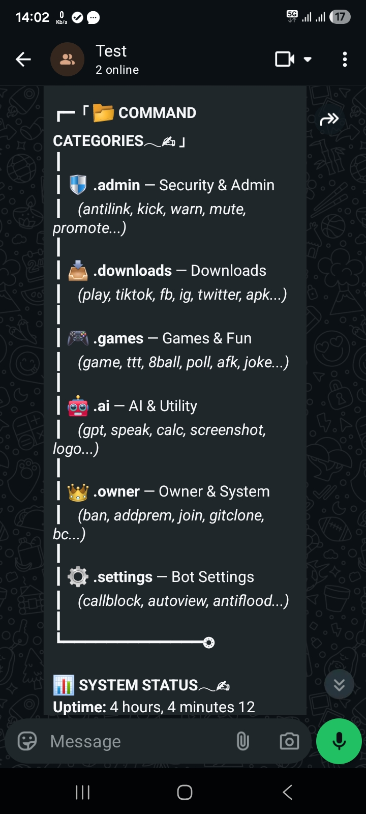
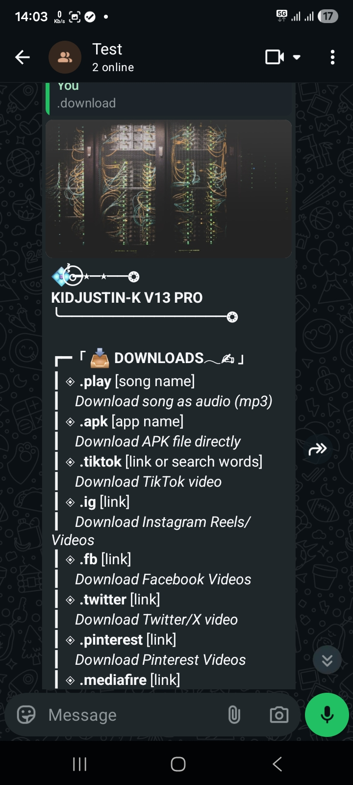
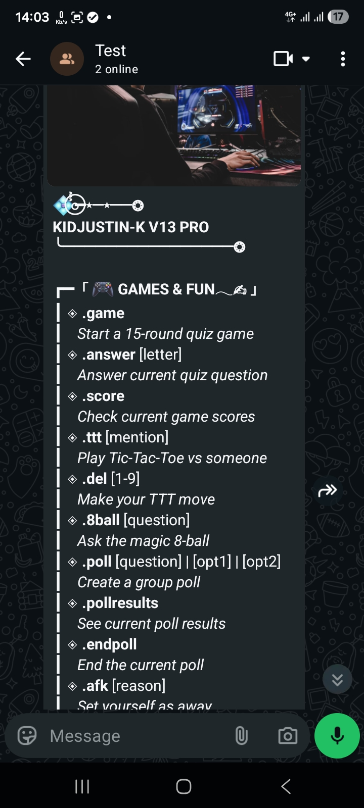

<div align="center">

  
  <br><br>

  <h1>🤖 KIDJUSTIN-K V13</h1>
  <p><i>The Master Planner's Ultimate WhatsApp Automation Suite</i><br>
  <b>Powered by Vortex Tech</b></p>

  <p>
    <a href="https://rentry.co/Kidjustin-license">
      
    </a>
    <a href="https://github.com/tinotendadurani55/effective-octo-waffle/releases">
      
    </a>
    
  </p>

  <p>
    <a href="https://github.com/tinotendadurani55/effective-octo-waffle/stargazers">
      
    </a>
    <a href="https://github.com/tinotendadurani55/effective-octo-waffle/network/members">
      
    </a>
    <a href="https://github.com/tinotendadurani55/effective-octo-waffle/issues">
      
    </a>
  </p>

  <p>
    
    
  </p>

  <br>

  <blockquote>
    <b>Production-grade WhatsApp automation engine built on Baileys.<br>Engineered for reliability, built for scale.</b>
  </blockquote>

</div>

---

## 📌 Table of Contents
- [Screenshots](#-screenshots)
- [Features](#-features)
- [Command Reference](#-command-reference)
- [Quick Deploy](#-quick-deploy-koyeb)
- [Manual Setup](#-manual-setup)
- [Environment Variables](#-environment-variables)
- [Architecture](#-architecture)
- [Contact](#-contact)

---

## 📸 Screenshots

<p align="center">
  
  
  
</p>
<p align="center">
  <em>Command Categories &nbsp;&nbsp;|&nbsp;&nbsp; Downloads Menu &nbsp;&nbsp;|&nbsp;&nbsp; Games & Fun Menu</em>
</p>

---

## ✨ Features

### 🛡️ Group Management & Security
| Feature | Description |
|---|---|
| **Anti-Link** | Automatically removes users who post unauthorized links in groups |
| **Anti-Flood** | Configurable spam detection with cooldown enforcement |
| **Call Blocker** | Auto-rejects incoming calls when enabled |
| **Blacklist** | Permanent ban list that persists across restarts |
| **Group Rules** | Set, list, and clear rules per group — stored in PostgreSQL |
| **Welcome Messages** | Custom per-group welcome messages with `{name}` and `{group}` placeholders |

### 📥 Media & Downloads
| Feature | Description |
|---|---|
| **YouTube** | Download audio (M4A) and video (360p) via yt-dlp |
| **TikTok** | Watermark-free video download |
| **Instagram** | Reel and post downloader |
| **MediaFire** | Direct cloud file retrieval |
| **Google Drive** | Direct link processor |

### 🎮 Games & Entertainment
| Feature | Description |
|---|---|
| **Quiz Game** | 15-round multi-choice trivia with live leaderboards |
| **Tic-Tac-Toe** | Real-time group TTT matches |
| **XP & Levelling** | Per-user XP tracking with auto level-up notifications |
| **Rep System** | Give reputation points to other users |
| **Wallpaper** | Random HD wallpaper generator |

### 🤖 AI & Automation
| Feature | Description |
|---|---|
| **Auto-Reply** | Built-in conversational responses + owner-teachable custom replies (`.learn`) |
| **AFK System** | Set away status with reason; auto-notifies anyone who mentions you |
| **Temp Mail** | Generate and read temporary email addresses |
| **Weather** | Live weather reports via OpenWeatherMap |
| **Poll System** | Create and vote on in-group polls |
| **Sticker Maker** | Convert images to WhatsApp stickers with custom pack metadata |
| **Auto Status View** | Silently reads all contacts' status updates |

### ⚙️ Bot Administration
| Feature | Description |
|---|---|
| **Premium Users** | Assign/revoke premium status — persisted across restarts |
| **Settings Per Group** | Toggle features independently per group |
| **PostgreSQL Persistence** | All settings, rules, and user data survive container restarts |
| **File Fallback** | Automatically falls back to local JSON if no DB is configured (Termux-friendly) |
| **Self-Diagnosis** | Startup checks for all required binaries and modules |
| **Anti-Crash** | Global uncaught exception handler ignores Baileys internal noise |

---

## 📋 Command Reference

> Default prefix: `.`  
> Owner commands require your number to match `OWNER_NUMBER`.

| Category | Commands |
|---|---|
| **🛡️ Admin** | `.admin` `.antilink` `.kick` `.warn` `.mute` `.promote` `.demote` `.tagall` `.ban` `.unban` |
| **📥 Downloads** | `.play` `.apk` `.tiktok` `.ig` `.fb` `.twitter` `.pinterest` `.mediafire` |
| **🎮 Games & Fun** | `.game` `.answer` `.score` `.ttt` `.del` `.8ball` `.poll` `.pollresults` `.endpoll` `.afk` `.joke` |
| **🤖 AI & Utility** | `.ai` `.speak` `.calc` `.screenshot` `.logo` `.weather` `.sticker` `.toimg` `.mail` `.wallpaper` |
| **👑 Owner & System** | `.owner` `.addprem` `.removeprem` `.join` `.gitclone` `.broadcast` `.restart` `.update` `.learn` `.forget` `.block` `.unblock` |
| **⚙️ Settings** | `.settings` `.callblock` `.autoview` `.antiflood` `.mode` `.setwelcome` `.setrules` `.clearrules` |

---

## 🚀 Quick Deploy — Koyeb

Click below for a one-click deployment. You will need to configure environment variables after deployment.

<p align="center">
  <a href="https://app.koyeb.com/deploy?type=git&repository=github.com/tinotendadurani55/effective-octo-waffle&branch=main&name=kidjustin-k">
    
  </a>
</p>

**Required after deploy:** Set your [environment variables](#-environment-variables) in the Koyeb dashboard under **Settings → Environment**.

---

## 🛠️ Manual Setup

### Prerequisites

- **Node.js** v20 or higher
- **FFmpeg** — for media processing
- **yt-dlp** — for YouTube/TikTok downloads

```bash
# Install yt-dlp
pip install yt-dlp

# Ubuntu/Debian — Install FFmpeg
sudo apt install ffmpeg

# Termux
pkg install ffmpeg yt-dlp
```

### Installation

```bash
# 1. Clone the repository
git clone https://github.com/tinotendadurani55/effective-octo-waffle.git
cd effective-octo-waffle

# 2. Install dependencies
npm install

# 3. Configure environment variables (see section below)
cp .env.example .env
nano .env

# 4. Start the bot
npm start
```

On first launch, a QR code will appear in the terminal. Scan it with WhatsApp to link your account.  
To avoid re-scanning on every restart, encode your session and set `SESSION_ID` in your environment variables.

---

## 🔐 Environment Variables

| Variable | Required | Description |
|---|---|---|
| `SESSION_ID` | ✅ | Base64-encoded WhatsApp session for Koyeb restarts |
| `OWNER_NUMBER` | ✅ | Your WhatsApp number (digits only, e.g. `263777426534`) |
| `BOT_NAME` | ✅ | Display name of the bot |
| `OWNER_NAME` | ✅ | Your display name |
| `PREFIX` | ✅ | Command prefix (default: `.`) |
| `MODE` | ✅ | `public` (anyone can use) or `private` (owner only) |
| `PORT` | ✅ | Health check port (default: `8000`, auto-set by Koyeb) |
| `DATABASE_HOST` | ⚡ Recommended | PostgreSQL host for persistent storage |
| `DATABASE_NAME` | ⚡ Recommended | PostgreSQL database name |
| `DATABASE_USER` | ⚡ Recommended | PostgreSQL username |
| `DATABASE_PASSWORD` | ⚡ Recommended | PostgreSQL password |
| `OPENWEATHERMAP_KEY` | Optional | API key for `.weather` command |
| `REPORT_NUMBER` | Optional | Number to forward `.report` messages to |

> ⚡ **Without a database**, all settings reset on every container restart. For Koyeb, a free PostgreSQL provider such as [Neon](https://neon.tech) is strongly recommended.

---

## 🏗️ Architecture

```
effective-octo-waffle/
├── index.js            # Core — Baileys connection, event handlers, command router
├── package.json        # Dependencies and scripts
├── session/            # Encrypted WhatsApp auth state (auto-generated)
├── downloads/          # Temporary media files (auto-purged)
└── database.json       # Local persistence fallback (used when no DB is configured)
```

**Tech Stack**

| Layer | Technology |
|---|---|
| WhatsApp Client | [@whiskeysockets/baileys](https://github.com/WhiskeySockets/Baileys) |
| Runtime | Node.js 20+ (CommonJS) |
| HTTP / Health Check | Express |
| Media Processing | FFmpeg + yt-dlp |
| Database | PostgreSQL (via `postgres.js`) with JSON file fallback |
| Hosting | Koyeb (also supports Termux) |

---

## 🤝 Contributing

Pull requests are welcome. For major changes, please open an issue first to discuss what you would like to change.

1. Fork the repository
2. Create a feature branch: `git checkout -b feature/your-feature`
3. Commit your changes: `git commit -m 'Add some feature'`
4. Push to the branch: `git push origin feature/your-feature`
5. Open a Pull Request

---

## 📄 License

This project is licensed under the **MIT License** — see the [LICENSE](LICENSE) file for details.

---

## 📬 Contact

**t.Durani** — Full-Stack Developer · Bot Architect · System Engineer

<p align="left">
  <a href="mailto:tinotendadurani55@gmail.com">
    
  </a>
  <a href="https://wa.me/263777426534">
    
  </a>
  <a href="https://github.com/tinotendadurani55">
    
  </a>
</p>

> For bugs and feature requests, please [open an issue](https://github.com/tinotendadurani55/effective-octo-waffle/issues) rather than sending a direct message.

---

<p align="center">
  Built with ❤️ by <strong>t.Durani</strong> · Zimbabwe 🇿🇼
</p>
